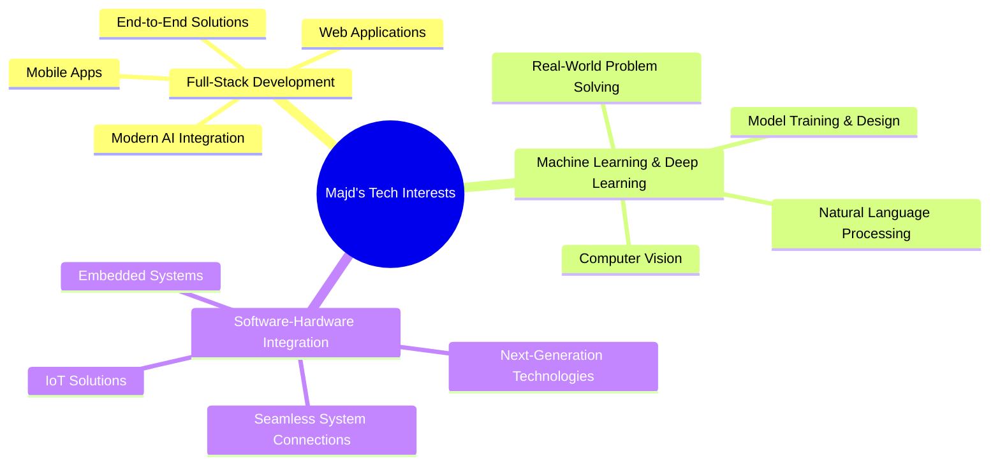

# 👋 Majd Salameh

<div align="center">

**🚀 Junior Software Engineer** | 💻 Full-Stack Development | 🤖 Machine Learning

*Passionate software engineer with expertise in building scalable web and mobile applications, integrating AI/ML solutions, and bridging software-hardware systems. Currently seeking opportunities to contribute to innovative development teams.*


</div>

---

## 🛠️ Technical Expertise

<div align="center">

| 💻 **Programming Languages** | 🌐 **Full-Stack Development** | ☁️ **Data & Cloud** | 🤖 **AI/ML** |
|:---:|:---:|:---:|:---:|
| C, C++, Python | React, Next.js | MySQL, MongoDB | PyTorch, TensorFlow |
| Java, JavaScript | Node.js, Express.js | Google Cloud, AWS | MediaPipe, OpenCV |
| | Flutter, FastAPI | Docker, CI/CD | NumPy, Pandas |

</div>

**🔧 Core Technologies**
```
Frontend     ⚡ React • Next.js • Flutter
Backend      ⚡ Node.js • Express.js • Flask • FastAPI  
Databases    ⚡ MySQL • MongoDB • Firebase
Cloud        ⚡ GCP • AWS • Vercel • Docker
AI/ML        ⚡ PyTorch • TensorFlow • OpenCV
Testing      ⚡ Unit Testing • Integration Testing • Automation
```

---

## 🎓 Education

<div align="center">

🏛️ **Bachelor of Science in Software Engineering**  
📍 *Braude College of Engineering*  
📅 *Oct 2021 - Sep 2025*

</div>

---

## 🚀 Featured Projects

### 🎯 Visual Speech Recognition System
> **Tech Stack:** `Python` `PyTorch` `TensorFlow` `Flask` `React` `MediaPipe`  
> [📁 View Repository](https://github.com/majdsalameh1211/visospeak)

🤖 AI-powered lip-reading system utilizing deep learning and computer vision for speech prediction from visual input.

✅ Developed scalable preprocessing pipelines for **2TB dataset** management  
✅ Implemented parallel GPU workflows for **real-time inference** optimization  
✅ Integrated cloud infrastructure using **Google Cloud Platform** for high-performance processing  

---

### 🌐 Social Network Application  
> **Tech Stack:** `React` `Next.js` `Node.js` `Express.js` `MongoDB` `Vercel`  
> [📁 View Repository](https://github.com/majdsalameh1211/Networking)

💬 Real-time social networking platform featuring instant messaging, notifications, and secure authentication.

✅ Architected scalable backend APIs with **cloud deployment**  
✅ Implemented comprehensive **integration testing** for system reliability  
✅ Optimized performance for **enhanced user experience**  

---

### 💼 WhatsApp CRM Chatbot  
> **Tech Stack:** `Node.js` `Green API` `Google Sheets API` `GCP`  
> [📁 View Repository](https://github.com/majdsalameh1211/WhatsApp-ChatBot-JS-and-GreenAPI-)

🤖 Cost-efficient customer relationship management chatbot for automated scheduling and client interactions.

✅ Integrated **Google Sheets API** for real-time data logging and management  
✅ Developed **automated workflows** for customer engagement and reporting  
✅ Designed **scalable architecture** for business process automation  

---

### 📱 Children's Book Mobile Application  
> **Tech Stack:** `Flutter` `Firebase`  
> [📁 View Repository](https://github.com/majdsalameh1211/Android_Course)

📚 Cross-platform mobile application for children's book browsing, uploading, and downloading functionality.

✅ Implemented **Firebase backend integration** for real-time data storage  
✅ Developed **user authentication** and content management systems  
✅ Designed **intuitive UI** optimized for mobile experience  

---

### 🏞️ Park Management System  
> **Tech Stack:** `Java` `JavaFX` `MySQL`  
> [📁 View Repository](https://github.com/majdsalameh1211/GoNature)

🖥️ Desktop application for park reservation and scheduling management with comprehensive testing implementation.

✅ Developed robust **reservation system** with MySQL database integration  
✅ Implemented comprehensive **unit and integration testing** strategies  
✅ Applied **black-box and white-box testing** methodologies for quality assurance  

---

## 📬 Connect With Me

<div align="center">

[](https://www.linkedin.com/in/majd-salameh-96745524b/)
[](https://portfolio-new-six-smoky.vercel.app/)
[](mailto:majdSalameh9@gmail.com)
[](https://github.com/majdsalameh1211)

</div>

---

## 🎯 Areas of Interest & Future Goals

<div align="center">



</div>

**🚀 Core Focus Areas:**

1. **Full-Stack Development (Web & Mobile)** – Building end-to-end web and mobile applications while integrating **modern AI models and tools** into real-world solutions.

2. **Machine Learning & Deep Learning** – Designing and training models to solve challenging problems, from computer vision to natural language processing.

3. **Bridging Software and Hardware** – Creating solutions that seamlessly connect software systems with hardware for next-generation technologies.

**🔍 Currently Exploring:**
- Advanced React patterns and Next.js 13+ features
- Integration of AI/ML models into full-stack applications
- Real-time computer vision applications with hardware acceleration
- IoT and embedded systems programming
- MLOps and AI model deployment strategies

**🎯 Career Objectives:**
- Contributing to innovative software development teams that blend AI with traditional development
- Building scalable, intelligent applications that bridge digital and physical worlds
- Developing cutting-edge solutions that integrate machine learning with hardware systems
- Continuous learning and professional growth in emerging AI-driven technologies

---

<div align="center">

⭐ **"Code is poetry written for machines to understand and humans to maintain"** ⭐

*Thanks for visiting! Feel free to explore my repositories and connect with me for collaboration opportunities.*

</div>
